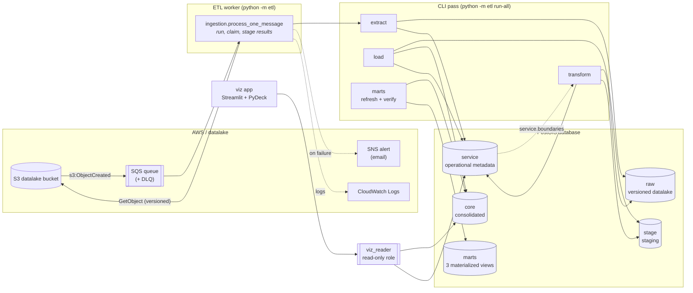
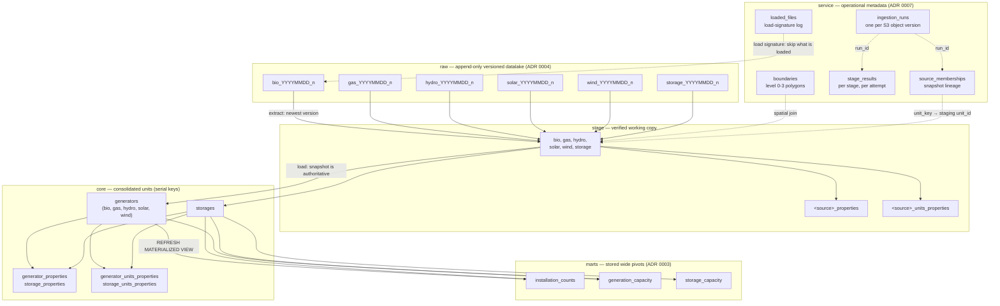
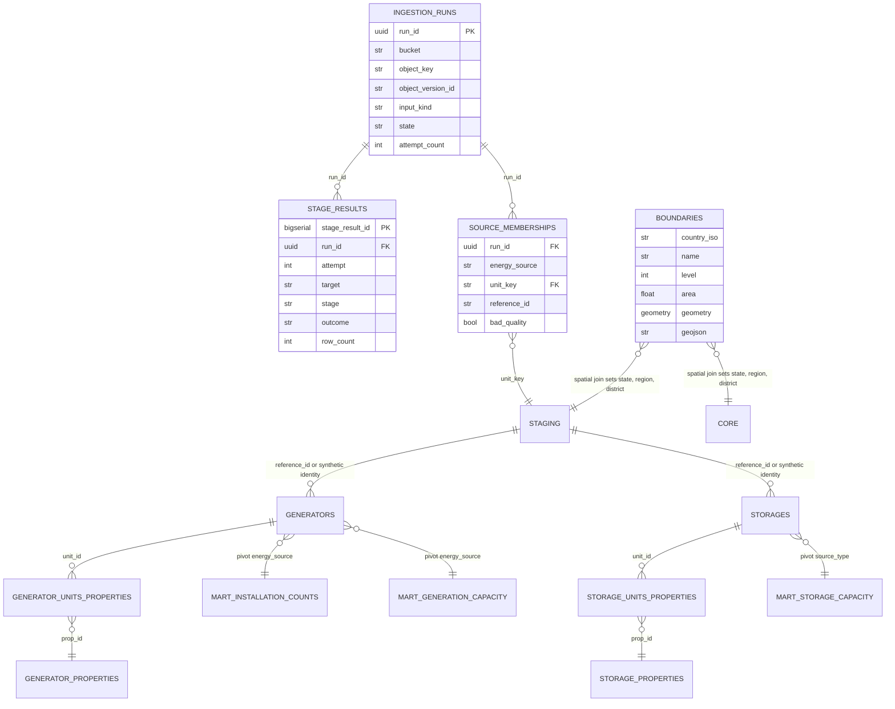
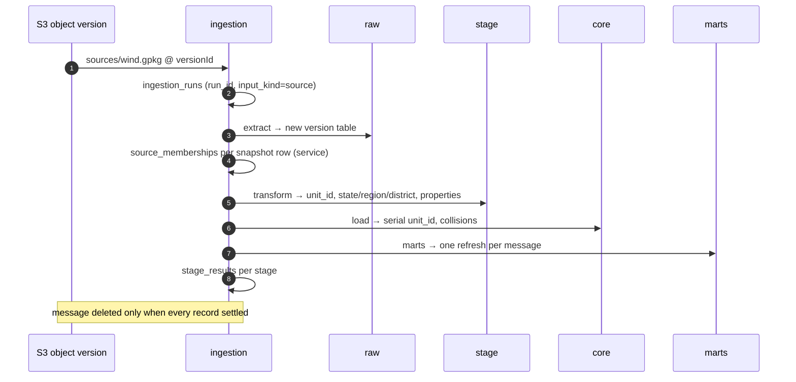
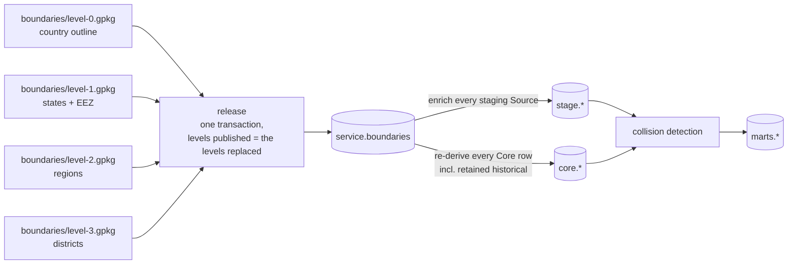
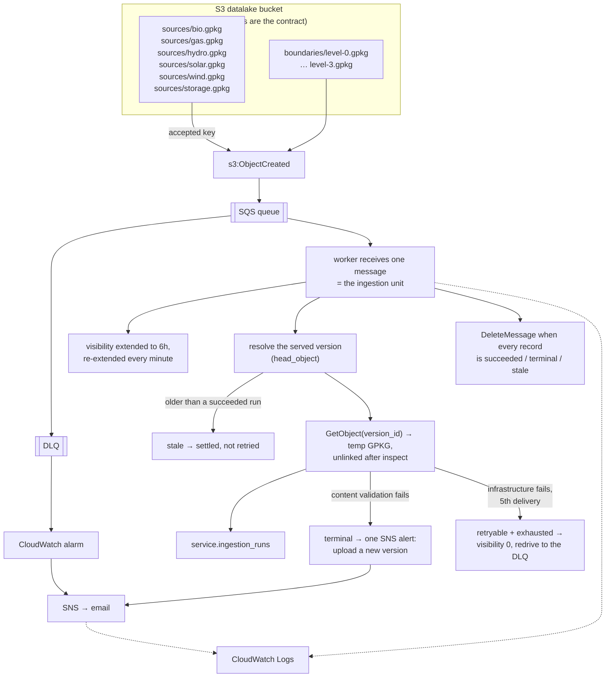
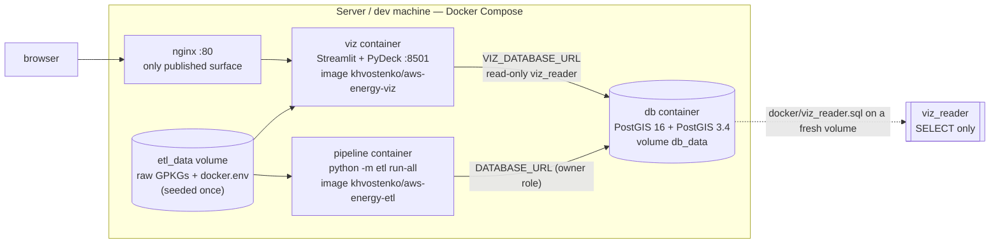
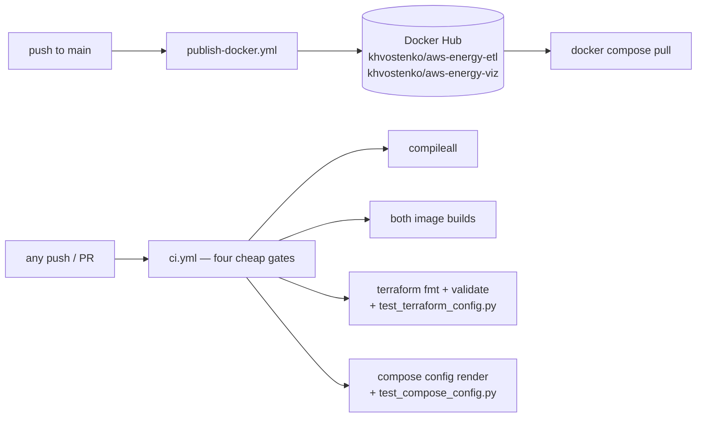

# Lineage and data layers

A single picture of how a row travels from a published GPKG in S3 to a number on
the dashboard, what lives in each schema, and where the AWS pieces sit. Written
from the code and `TechnicalSpecification.md`; where the spec and the code
disagree, the code wins and the discrepancy is called out (see
[Discrepancies](#5-discrepancies)).

- **Lineage** — which key identifies a record at each hop
- **Data layers** — the five schemas, their tables and their keys
- **AWS integration** — the event path, the container stack, CI/CD
- **What is left to the account** — the steps that need the AWS account or a
  human, not another line of code here

Physical schema names default to `raw`, `stage`, `core`, `service`, `marts`
(`etl/config.py`; each is overridable per environment). The layer is called
*Staging*; the schema it lands in is `stage`.

---

## 1. End-to-end lineage

Read it as: **S3 is the only input**, `service` holds the bookkeeping and the
reference geography, `raw` keeps an append-only history, `stage` is the working
copy, `core` is the consolidated truth, `marts` is the pre-aggregated serving
shape, and the `viz_reader` role is the only door the app has into the database.

---

## 2. Data layers

### 2.1 Schema map

### 2.2 raw — versioned datalake

One table per **extract**, never overwritten: `raw.<source>_<YYYYMMDD>_<n>`, the
counter restarting each day. Same shape for all six sources plus two extra
columns for storage (`storage_type`, `storage_capacity`); `secondary_attributes`
holds the jsonb of everything not decomposed.

| Column | Type | Notes |
|---|---|---|
| `energy_source` | str | routed from the column, never the filename (`AWS.md` §2) |
| `installed_capacity` | float | kW |
| `commissioning_date` / `decommissioning_date` | date | |
| `storage_type`, `storage_capacity` | str, float | storage only |
| `x_coordinates`, `y_coordinates` | float | WGS-84 |
| `geo_accuracy` | int | 1 = exact, 2 = approximate |
| `geometry` | point | WGS-84, PostGIS |
| `reference_id`, `reference_date` | str, timestamp | identity and as-of date in the source |
| `secondary_attributes` | jsonb | folded attributes (ADR 0006 era: raw carries them inline) |

### 2.3 service — operational metadata

Not part of the datalake; deliberately separate (ADR 0007).

| Table | Key | Written by | Purpose |
|---|---|---|---|
| `loaded_files` | append-only, no unique constraint | extract | load signature `(filename, filesize, modified_at)`; a re-extract is skipped unless `-f` |
| `boundaries` | non-versioned, `level` 0-3 | extract (bootstrap) / boundaries release | `country_iso`, `name`, `level`, `area` km², `geometry` multipolygon, `geojson` (pre-simplified for the app) |
| `ingestion_runs` | `run_id`; unique `(bucket, object_key, object_version_id)` | ingestion | one processing lifecycle: `input_kind` (`source`\|`boundary`), `state` (pending, running, succeeded, retryable, terminal, stale), `attempt_count`, `object_last_modified` |
| `stage_results` | unique `(run_id, attempt, target, stage)` | ingestion | per-stage outcome, `row_count`, `error`, `details` jsonb, for stages processing / extract / transform / load / marts / bootstrap |
| `source_memberships` | `(run_id, unit_key)` | ingestion | which units a snapshot carried, bad-quality ones included — lineage, **not** an active flag |

### 2.4 stage — the verified working copy

`stage.<source>` for the six sources, plus a per-source property dimension and
link table (ADR 0006 splits the dimension by unit kind in core; in staging it is
per source). Identity is the canonical `energy_source` + `reference_id`; a row
without a `reference_id` gets a synthetic hash of source, `location`,
coordinates rounded to six decimals, and `geo_accuracy` (ADR 0001) — capacity
and dates are deliberately **not** part of it, so identity cannot move when a
unit's data changes.

Added on top of raw: `unit_id` (pk), `country_iso`, `state`, `region`,
`district` (from `service.boundaries`), `bad_quality`.

| Table | Key | Purpose |
|---|---|---|
| `bio`, `gas`, `hydro`, `solar`, `wind`, `storage` | `unit_id` | the enriched, quality-gated snapshot |
| `<source>_properties` | `param_id`; unique `(name, value)` | decomposed attributes |
| `<source>_units_properties` | `(unit_id, param_id)` | link |

A staging table present in the database means *verified* — a failed snapshot
transform drops its tables rather than leaving a partial copy for the next load
(issue #4).

### 2.5 core — consolidated units

`core.generators` and `core.storages` carry a serial `unit_id` plus a data-integrity
unique index on `(energy_source, reference_id)`; a complete Source snapshot is
authoritative (ADR 0001):

- **in** the snapshot → `UPDATE` in place, `unit_id` stable, property links refreshed
- **not in** the snapshot → retained untouched, so historical units survive; the
  snapshot's membership ends in `source_memberships` instead
- a boundary release re-derives `state`/`region`/`district` for **every** row, retained
  ones included, straight from each unit's own geometry (issue #5)

Quality annotations live as property links, not flags: `collision` plus
`close_to` naming the neighbour (ADR 0005), with
`generator_properties`/`storage_properties` and their link tables per kind
(ADR 0006).

### 2.6 marts — stored wide pivots

Three `MATERIALIZED VIEW`s at **state** grain, refreshed on demand and verified
(ADR 0003). Only active units contribute, so all three agree by construction;
`state IS NULL` collapses into the `outside` bucket.

| View | Pivot | Value |
|---|---|---|
| `marts.installation_counts` | `energy_source` | `COUNT(*)` over active generators ∪ storages |
| `marts.generation_capacity` | `energy_source` | `SUM(installed_capacity)` |
| `marts.storage_capacity` | `source_type` | `SUM(storage_capacity)` |

The stored shape cannot answer date-range or decommissioned queries, and the app
does not read it: the viz header aggregates from `core` with its own active-unit
predicate so the map and the header always resolve the same set (issue #24). The
marts are the analyst/reporting surface, and they are what the drift checks read:
`marts.verify_marts` reconciles each stored pivot against current core, and
`scripts/smoke_etl_container.sh` asserts the three matviews exist at state grain
including the `outside` bucket.

---

## 3. Lineage: one unit, end to end

| Hop | Key that carries the row | Where the key is written |
|---|---|---|
| file → run | `(bucket, object_key, object_version_id)` | `service.ingestion_runs` — immutable input identity, also the idempotency guard |
| run → raw | `<source>_<YYYYMMDD>_<n>` + row order | `raw`, append-only; the version table name is recorded in the load log |
| raw → stage | `unit_id` = canonical `energy_source` + `reference_id`, or the synthetic hash | `stage.<source>`, mirrored in `source_memberships.unit_key` |
| stage → core | `reference_id` when present, else the recomputed synthetic hash; `unit_id` becomes a serial integer | `core.generators` / `core.storages` |
| core → marts | `state` grain (with the `outside` bucket) | the three materialized views |
| core → app | `unit_id` (not exposed) + `energy_source`, coordinates, capacity | read by `viz_reader` |

**Geography is a second, independent lineage**: `boundaries/level-<n>.gpkg` →
`service.boundaries` (one atomic release transaction per message, issue #5) →
every staging Source and every Core row → collisions → marts. A unit's state is
its geography, so a boundary release re-derives units that no snapshot touched.

---

## 4. AWS integration

### 4.1 Event path and bucket layout

The event wiring above is Terraform (`terraform/s3.tf`, `terraform/sqs.tf`,
`terraform/cloudwatch.tf`): the S3 notification onto the queue, the redrive
policy with `maxReceiveCount = 5`, and the DLQ alarm are declared in this repo
and applied to the account (ADR 0010). The delivery contract those resources
carry is pinned against `etl/ingestion.py` by `tests/test_terraform_config.py`.

What the pipeline container runs is `python -m etl startup` and then the worker
loop: the startup applies the current Boundary releases, enqueues the Source
object versions that have no run yet, and refuses to start the worker when a
Boundary level is missing (ADR 0009). A rejected object version is announced by
the worker; a message that runs out of deliveries is announced by the DLQ alarm,
so each problem is alerted once. The receive loop is verified end to end, startup
through redrive, by `tests/test_acceptance_workflow.py`
([§6](#6-what-is-left-to-the-account) lists what is left to the account).

The bucket key is the contract: `sources/<source>.gpkg` and
`boundaries/level-<n>.gpkg` are the only accepted keys, and the key alone
decides `input_kind` — never the file's content or name. The `energy_source` that
routes a row is read from the column, not the filename (`AWS.md` §2).

Versioned objects make the input identity immutable, which is what lets a
redelivery be recognised: an object whose `LastModified` is older than a
succeeded run settles as `stale` instead of being re-processed, and a version
already in `loaded_files` is not extracted twice.

The same immutability decides the retry contract. A *rejected object version* —
one that fails its own content validation, in the inspect step or in the
transform that follows it — will fail identically on every delivery, so its run
is `terminal` and it is alerted once. A database, S3 or marts failure is a
property of the moment, so the run stays `retryable` and the delivery is repeated
until SQS's `maxReceiveCount = 5` moves the message to the DLQ. The worker's
attempt number is SQS's `ApproximateReceiveCount`, so a crashed worker's message
is counted, not restarted for free. A message the worker keeps is handed straight
back to the queue when the work is over, so the redrive happens then and not six
hours later.

### 4.2 IAM and observability

The worker's EC2 role needs `s3:GetObject` and `s3:GetObjectVersion` on the fixed accepted
keys, `sqs:ReceiveMessage`, `DeleteMessage`, `ChangeMessageVisibility`, `SendMessage`,
`sns:Publish`, and `logs:CreateLogStream` / `logs:PutLogEvents` (`AWS.md` §5, §3). It is
not granted `s3:ListBucket` or `sqs:GetQueueAttributes`: nothing in the worker lists the
bucket or inspects the queue — the delivery count arrives as a message attribute on the
receive call. A rejected object version publishes an SNS alert; a message that runs out of
deliveries is dead-lettered and a CloudWatch alarm on the DLQ pages the same topic (§4).

### 4.3 Container stack

- The **pipeline** role owns the schemas; the **viz** app connects as
  `viz_reader`, which never receives `INSERT/UPDATE/DELETE` and whose grants
  survive the pipeline's table drops and mart refreshes.
- The detached `etl_data` volume carries the private raw data and
  `DATABASE_URL` / `VIZ_DATABASE_URL`; nothing data-like is baked into an image
  or into the compose file (`scripts/seed_data_volume.sh`).
- `compose.yaml` (server) publishes only nginx; `local_compose.yaml` publishes
  the app directly at `:8501`; `build_compose.yaml` builds both images from this
  repo instead of pulling.

### 4.4 CI/CD

Every gate needs no PostGIS, no raw data and no AWS credentials, so a renamed
CLI command or a changed port fails a pull request instead of a deployment:
byte-compile, both image builds, `terraform fmt -check` / `init -backend=false` /
`validate` plus `tests/test_terraform_config.py` (which pins the accepted keys and
the delivery contract to `etl/ingestion.py`), and `docker compose config` on all
three variants plus `tests/test_compose_config.py` — the container contract that
used to be reachable only through `scripts/smoke_etl_container.sh`, which needs
the private data set (ADR 0011).

The full integration suite needs a PostGIS service, so it runs locally
(`TEST_DATABASE_URL` against a scratch database) rather than in CI. The acceptance
walkthrough belongs to that suite, not to CI: it drives `startup`, `worker` and
`redrive` through the real processor against a real PostGIS with fake AWS
adapters, which is exactly the heavy flow CI has no service for.

---

## 5. Discrepancies

Files win over `TechnicalSpecification.md`; these are the ones that affect this
picture:

- The published files are `V20260203`, not the `V20250101` the spec names, and
  the gas file is `Gas_Producer_V20260203.gpkg`.
- The staging schema is `stage` by default; the spec calls the layer "Staging".
- The spec's Raw tables list `bio, gas, hydro, solar, wind`; storage was added
  as a sixth Source, so raw, stage and core are all six-per-kind.
- `service` holds the boundary reference layer, not `raw.boundaries` (ADR 0007
  superseded that part of ADR 0004).

## 6. What is left to the account

The event wiring, the infrastructure and the operator startup all exist in this
repo (ADR 0009, ADR 0010, ADR 0011); what no code here can do is put them in the
account:

- **The apply, and the two steps the provider cannot take.** Attaching the
  instance profile to the running host, and installing the rendered CloudWatch
  agent config, are one CLI call and one file each (`terraform/README.md`). The
  SNS email subscription stays silent until the operator clicks the
  confirmation.
- **The data itself.** The bucket is empty until an upload happens: six Source
  snapshots and four Boundary levels under the ten accepted keys, with object
  versioning on. Until then startup has nothing to enqueue, no message reaches
  the worker, and every layer above `service` stays empty.
- **The host.** Terraform creates no EC2 instance, no VPC and no RDS — the
  Compose stack and its PostGIS run on a host the account already has.

One thing is absent by design rather than by omission: the admin and API surfaces
in the spec's Serving section do not exist. `AWS.md` §7 lists the rest of the
non-goals.
